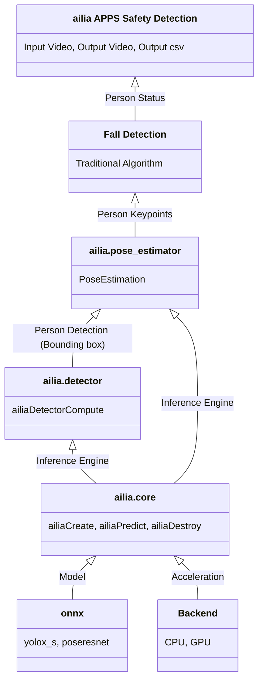

# ailia-apps-safety-detection

## Architecture

```mermaid
classDiagram
`ailia APPS Safety Detection` <|-- `Fall Detection` : Person Status
`Fall Detection` <|-- `ailia.pose_estimator` : Person Keypoints
`ailia.pose_estimator` <|-- `ailia.detector` : Person Detection (Bounding box)
`ailia APPS Safety Detection` : Input Video, Output Video, Output csv
`Fall Detection` : Traditional Algorithm
`ailia.detector` <|-- `ailia.core` : Inference Engine
`ailia.core` <|-- `onnx` : Model
`ailia.pose_estimator` <|-- `ailia.core` : Inference Engine
`ailia.pose_estimator` : PoseEstimation
`ailia.detector` : ailiaDetectorCompute
`ailia.core` : ailiaCreate, ailiaPredict, ailiaDestroy
`ailia.core` <|-- Backend : Acceleration
`onnx` : yolox_s, poseresnet
`Backend` : CPU, GPU
```

