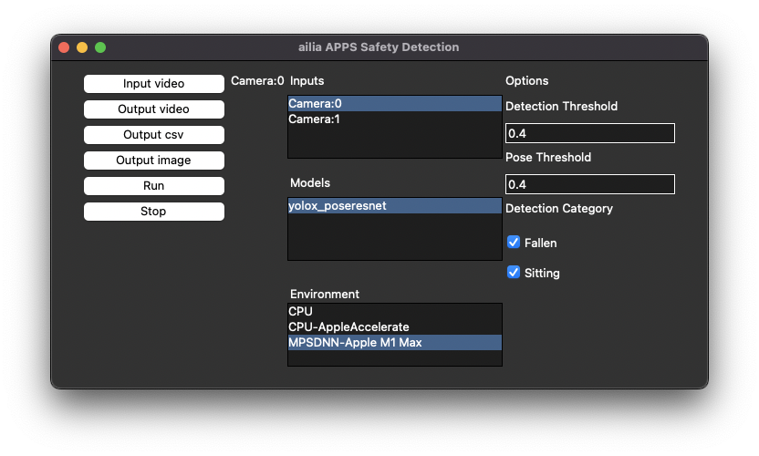
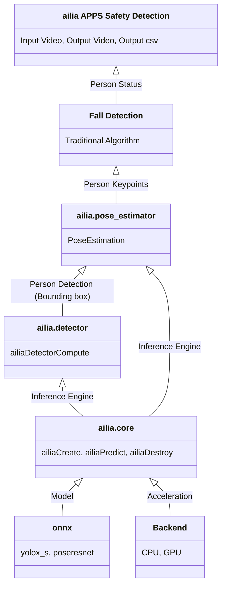

# ailia APPS Safety Detection

Detects people who are lying down or sitting down.

# Functions

- Detect lying down and sitting down

# Requirements

- Windows, macOS, Linux
- Python 3.7 and later
- ailia SDK 1.2.13 and later

# Basic Usage

1. Put this command to open GUI.

```
python3 ailia-apps-safety-detection.py
```



2. Push "Input video" button to select input video

3. Push "Run" button to execute the app


# Architecture



# Test video

TBD

